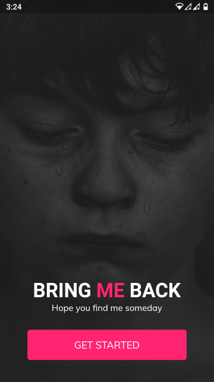
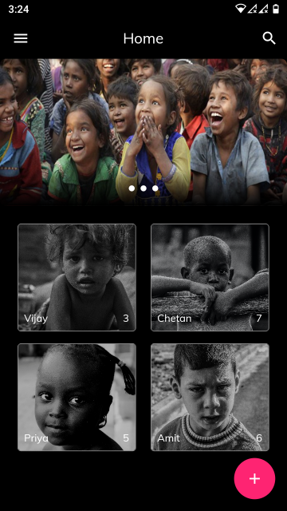
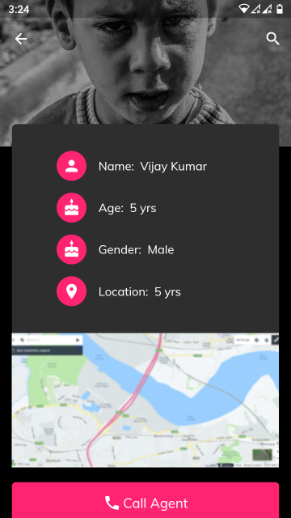
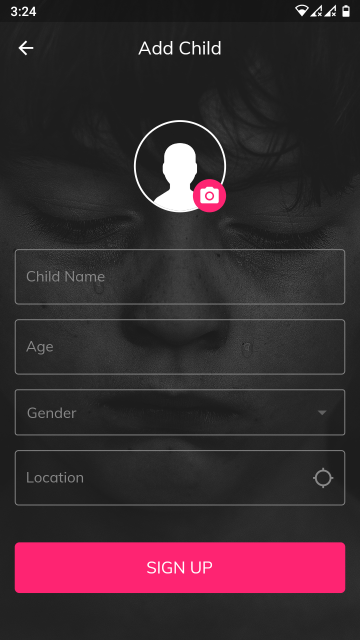
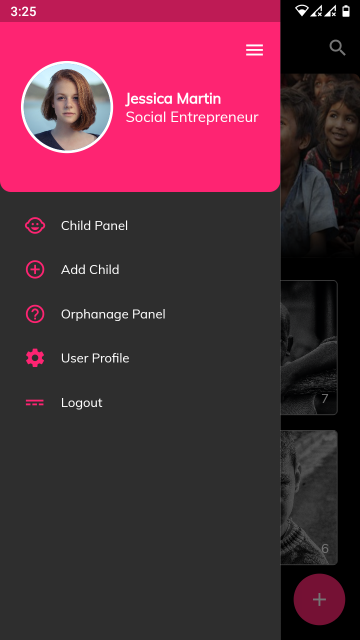

> What We Learn With Pleasure We Never Forget - Alfred Mercier

## (Flutter UI Pracitce Projects) 

> For practice projects, i pick random UI designs by UI/UX designers from Instagram, i try my level best to recreate the UI design in Dart & Flutter. The repo contains all the code and assets used.

## [Bring Me Back UI](https://www.instagram.com/p/B-v5jPYgzxQ/) UI is designed by : [Shashank Tyagi](https://www.behance.net/shashank25)

## App UI Screenshot

 

 

 

## Assets Usage Credit

[Photo](https://www.pexels.com/photo/greyscale-close-up-photo-of-young-girl-2505397/) by [Muhammadtaha Ibrahim Ma'aji](https://www.pexels.com/@captaintaha9?utm_content=attributionCopyText&utm_medium=referral&utm_source=pexels) from [Pexels](pexels.com)

[Photo](https://www.pexels.com/photo/grayscale-photo-of-toddler-2421456/) by [Prince Kumar](https://www.pexels.com/@prince-kumar-781937?utm_content=attributionCopyText&utm_medium=referral&utm_source=pexels) from [Pexels](pexels.com)

[Photo](https://www.pexels.com/photo/grayscale-photograph-group-of-children-1002061/) by [Dazzle Jam](https://www.pexels.com/@dazzle-jam-374075?utm_content=attributionCopyText&utm_medium=referral&utm_source=pexels) from [Pexels](pexels.com)

[Photo](https://www.pexels.com/photo/photo-of-a-boy-2415608/) by [Mohamedamine Abbas](https://www.pexels.com/@algerianphotographer?utm_content=attributionCopyText&utm_medium=referral&utm_source=pexels) from [Pexels](pexels.com)

[Photo](https://www.pexels.com/photo/grayscale-photo-of-little-boy-1029783/) by [Dazzle Jam](https://www.pexels.com/@dazzle-jam-374075?utm_content=attributionCopyText&utm_medium=referral&utm_source=pexels) from [Pexels](pexels.com)

[Group of childrens](https://thepolicytimes.com/poverty-impacts-brain-and-behavioural-development-of-poor-children/)

[Photo](https://unsplash.com/photos/rDEOVtE7vOs) by [Christopher Campbell](https://unsplash.com/@chrisjoelcampbell?utm_source=unsplash&utm_medium=referral&utm_content=creditCopyText) on [Unsplash](https://unsplash.com/)

[Photo](https://unsplash.com/photos/DPmoxmj-ok0) by [Bennett Tobias](https://unsplash.com/@bwtobias?utm_source=unsplash&utm_medium=referral&utm_content=creditCopyText) on [Unsplash](https://unsplash.com/)

[Photo](https://unsplash.com/photos/NPmR0RblyhQ) by [Kat J](https://unsplash.com/@kj2018?utm_source=unsplash&utm_medium=referral&utm_content=creditCopyText) on [Unsplash](https://unsplash.com/)

